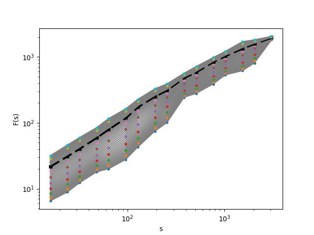
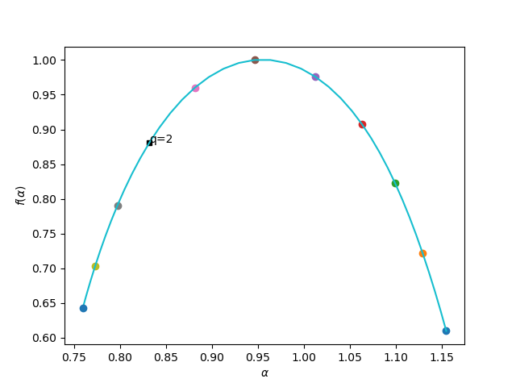

# Fractality and Long-Range Correlations
Fractality is a characteristic of a complex system in which self-similarity at different scales can be found. Fractality quantifies dynamically fluctuating variability of systems through multi-scale analyses and provides insights into underlying structures of objects under study. Probably the most widely used methods to analyze fractality and long-range correlations are Detrended Fluctuation Analysis (DFA; Peng et al., 1994) and Multi-Fractal Detrended Fluctuation Analysis (MFDFA; Kantelhardt et al., 2002), which is an extension of DFA. For further explanation, please refer to this medium [post](https://medium.com/@mohsenim/fractality-and-long-range-correlations-case-studies-and-insights-from-the-textual-domain-81810720c4d1) or [this](https://github.com/mohsenim/Multifractality/blob/main/MFDFA.md) Github page. 

This library implement MFDFA and provides also funtions for represent of results.

# Installation

You can install `mfdfa-toolkit` using `pip`:

```
pip install mfdfa-toolkit
```
or from the Github repository:
```
pip install git+https://github.com/mohsenim/Multifractality.git
```

# Using mfdfa-toolkit
To apply MFDFA to a series:

```python
from mfdfa_toolkit import MFDFA
import numpy as np

x = np.loadtxt('./examples/Henry-James_The-Golden-Bowl.txt')
result = MFDFA(x)
print(f"Degree of fractality: {result['H']:.2f}")
print(f"Degree of multifractality: {result['multifractality']:.2f}")
print(f"Goodness of fit(R2):{result['R2'].mean():.2f}")
```
Fluctuations, $F_q(s)$, can be visualized using `visualization`: 
```python
from mfdfa_toolkit import visualization
import matplotlib.pyplot as plt

fig, ax = plt.subplots(1)
visualization.plot_fluctuations(result, ax)
```



Similarly, the singularity spectrum can be visualized: 
```python
from mfdfa_toolkit import visualization
import matplotlib.pyplot as plt

fig, ax = plt.subplots(1)
visualization.plot_fluctuations(result, ax)
```



You can view [MFDFA.ipynb](https://github.com/mohsenim/Multifractality/blob/main/MFDFA.ipynb) for running the code step by step and seeing examples.

### References
*  Peng, C.-K., S. V. Buldyrev, S. Havlin, M. Simons, H. E. Stanley, and A. L. Goldberger (1994). “Mosaic organization of DNA nucleotides”. In: Physical Review E 49.2, pp. 1685–1689.
*  Kantelhardt, JanW., Stephan A. Zschiegner, Eva Koscielny-Bunde, Shlomo Havlin, Armin Bunde, and H.Eugene Stanley (2002). “Multifractal detrended fluctuation analysis of nonstationary time series”. In: Physica A: Statistical Mechanics and Its Applications 316.1, pp. 87–114.
* Mohseni, Mahdi,Volker Gast, and ChristophRedies (2021). “Fractality andVariability in Canonical and Non-Canonical English Fiction and in Non-Fictional Texts”. In: Frontiers in Psychology 12, p. 920.
